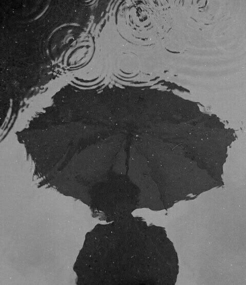
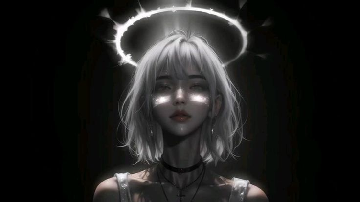

<picture>
  <source media="(prefers-color-scheme: dark)" srcset="./Angeldark.jpg">
  <source media="(prefers-color-scheme: light)" srcset="./Angellight.jpg">
  
</picture>

 

# Hi, I'm Muhammad Rizqan 🌒

### Designing, building, and learning through technology.

 I'm an Information Technology graduate from Brawijaya University with a passion for UI/UX Design, Digital Marketing, Game Design, and digital experiences. I enjoy combining creativity, visual communication, analytical thinking, and problem-solving to create experiences that are functional, engaging, and meaningful from designing digital interfaces and content to building environments in Roblox. I'm continuously learning, experimenting, and looking for opportunities to turn ideas into thoughtful digital experiences.

  I like creating things that feel thoughtful, useful, and visually engaging where engineering meets creativity.

---

  

## About Me

I’m an Information Technology graduate with a passion for UI/UX design, digital marketing, and game design. I enjoy turning ideas into digital experiences by combining creativity, technology, and problem-solving.

I’m always curious to learn, experiment, and improve through real-world projects. Whether it’s designing an interface, creating digital content, or building a virtual environment, I enjoy the process of turning ideas into something meaningful and engaging.

- 🎓 Information Technology graduate from Brawijaya University
- 🎨 Interested in UI/UX Design, Digital Marketing & Game Design
- 🧩 Enjoy turning ideas into meaningful digital experiences
- 🎮 Exploring game design, Roblox building & virtual environments
- ✨ Passionate about creativity, visual design & problem-solving

---

   

## Current Focus

Right now, I’m focusing on:

- 🎨 UI/UX Design and user-centered digital experiences
- 📱 Digital Marketing, content creation & digital campaigns
- 🎮 Game Design and Roblox environment development
- 🧩 Exploring the intersection of design, technology & creativity
- 🚀 Continuous learning through real-world projects and experimentation

---

   

## Toolbox

### Design

  
  

### Digital & Game

  
  
  
  

### Workflow

  
  
  
  
  

### Productivity

  
  

---

  

## Night Notes

> I enjoy exploring the space between creativity and technology.
> I like turning simple ideas into digital experiences, visual stories,
> and interactive worlds that feel meaningful and engaging.

A few words that describe me:

- curious
- creative
- adaptable
- thoughtful
- always exploring

---

  

## Connect With Me

  
  
  

   
  
    
  Thanks for visiting my corner of GitHub ✨

